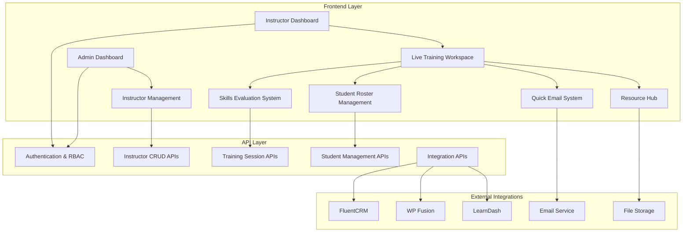

# Ultimate Instructor's Live Training Workspace - Architectural Plan

Based on my analysis of your current system, I've created a comprehensive plan to transform your app into the Ultimate Instructor's Live Training Workspace. Here's the detailed architectural overview:

## 🏗️ Current System Analysis

**Strengths Identified:**
- Solid Next.js foundation with TypeScript
- Existing Live Training Workspace with basic functionality
- Good component structure with shadcn/ui
- React Query for data management
- Basic instructor dashboard and event management

**Gaps to Address:**
- Missing role-based access control
- Limited instructor resource management
- Basic skills evaluation system
- No comprehensive admin management hub
- Limited external system integrations
- Missing tablet-optimized interface

## 🎯 System Architecture Overview



## 📋 Detailed Implementation Plan

### Phase 1: Foundation & Admin Hub (Weeks 1-2)

**1.1 Role-Based Access Control System**
- Implement user authentication with role differentiation
- Create middleware for route protection
- Design permission system for Admin vs Instructor access

**1.2 Enhanced Data Models**
- Expand instructor schema with detailed profiles
- Create comprehensive training session models
- Design student progress tracking schemas

**1.3 Admin Management Hub**
- Build comprehensive instructor CRUD system
- Create instructor profile pages with teaching history
- Implement advanced search and filtering
- Add bulk operations for instructor management

### Phase 2: Enhanced Instructor Experience (Weeks 3-4)

**2.1 Tablet-Optimized Interface**
- Redesign Live Training Workspace for tablet use
- Implement touch-friendly controls
- Create responsive layouts for various screen sizes
- Add gesture support for common actions

**2.2 Advanced Skills Evaluation System**
- Build detailed skills assessment criteria
- Create customizable evaluation forms
- Implement progress tracking with visual indicators
- Add note-taking capabilities for each student

**2.3 Student Profile Enhancement**
- Expand student data models
- Create detailed student history tracking
- Implement pre-course progress integration
- Add photo and identification features

### Phase 3: Resource Management & Communication (Weeks 5-6)

**3.1 Instructor Resource Hub**
- Create digital resource library
- Implement file upload and management
- Build quick-access resource cards
- Add version control for training materials

**3.2 Quick Email System**
- Build rich text email composer
- Implement template system
- Create bulk email functionality
- Add email tracking and delivery confirmation

**3.3 Real-time Progress Tracking**
- Implement live class progress indicators
- Create real-time attendance tracking
- Build completion rate analytics
- Add performance dashboards

### Phase 4: External Integrations & Automation (Weeks 7-8)

**4.1 FluentCRM Integration**
- Build API connectors for tag management
- Implement automated tagging workflows
- Create student profile synchronization
- Add campaign trigger capabilities

**4.2 WP Fusion & LearnDash Integration**
- Connect pre-course progress tracking
- Implement certificate automation
- Build course completion workflows
- Add learning path management

**4.3 Automated Certificate System**
- Create dynamic certificate templates
- Implement PDF generation with custom branding
- Build automated delivery system
- Add certificate tracking and verification

## 🔧 Technical Implementation Details

### Key Technologies & Libraries
- **Frontend**: Next.js 15, React 19, TypeScript, Tailwind CSS
- **UI Components**: shadcn/ui, Radix UI primitives
- **State Management**: React Query, Zustand for local state
- **Forms**: React Hook Form with Zod validation
- **Database**: PostgreSQL with Prisma ORM
- **Authentication**: NextAuth.js with role-based access
- **File Storage**: AWS S3 or Cloudflare R2
- **Email**: SendGrid or similar service
- **PDF Generation**: jsPDF or Puppeteer

### Database Schema Enhancements

```typescript
// Enhanced Instructor Model
interface Instructor {
  id: string;
  name: string;
  email: string;
  phone?: string;
  bio: string;
  specialties: string[];
  certifications: Certification[];
  teachingHistory: TrainingSession[];
  resources: InstructorResource[];
  availability: AvailabilitySchedule;
  performanceMetrics: InstructorMetrics;
}

// Enhanced Training Session Model
interface TrainingSession {
  id: string;
  eventId: string;
  instructorId: string;
  students: StudentEnrollment[];
  skillsEvaluations: SkillsEvaluation[];
  resources: SessionResource[];
  attendance: AttendanceRecord[];
  finalRoster: FinalRosterSubmission;
  sessionNotes: string;
  completionStatus: 'pending' | 'in-progress' | 'completed';
}

// Skills Evaluation System
interface SkillsEvaluation {
  id: string;
  studentId: string;
  sessionId: string;
  criteria: EvaluationCriteria[];
  overallStatus: 'not-started' | 'passed' | 'needs-review';
  instructorNotes: string;
  evaluationDate: Date;
  retakeRequired: boolean;
}
```

## 📱 Mobile & Tablet Optimization Strategy

### Responsive Design Principles
- **Mobile-first approach** with progressive enhancement
- **Touch-friendly interfaces** with minimum 44px touch targets
- **Gesture support** for common actions (swipe, pinch, tap)
- **Offline capability** for critical functions
- **Performance optimization** for slower connections

### Tablet-Specific Features
- **Split-screen layouts** for multitasking
- **Drag-and-drop functionality** for roster management
- **Quick action buttons** for common tasks
- **Landscape orientation optimization**
- **Apple Pencil support** for note-taking (iPad)

## 🔐 Security & Performance Considerations

### Security Measures
- **Role-based access control** with JWT tokens
- **API rate limiting** to prevent abuse
- **Input validation** with Zod schemas
- **SQL injection prevention** with Prisma
- **XSS protection** with proper sanitization
- **HTTPS enforcement** for all communications

### Performance Optimizations
- **Server-side rendering** for initial page loads
- **Code splitting** for reduced bundle sizes
- **Image optimization** with Next.js Image component
- **Caching strategies** with React Query and Redis
- **Database indexing** for fast queries
- **CDN integration** for static assets

## 🚀 Deployment & Rollout Strategy

### Staging Environment
- **Feature branch deployments** for testing
- **Automated testing pipeline** with Jest and Playwright
- **Performance monitoring** with Lighthouse CI
- **User acceptance testing** with instructor feedback

### Production Rollout
- **Phased deployment** starting with power users
- **Feature flags** for gradual feature rollout
- **Monitoring and alerting** with comprehensive logging
- **Rollback procedures** for quick issue resolution
- **User training materials** and documentation

## 📊 Success Metrics & KPIs

### Instructor Experience Metrics
- **Time to complete roster submission** (target: <5 minutes)
- **Skills evaluation completion rate** (target: >95%)
- **User satisfaction scores** (target: >4.5/5)
- **Mobile usage adoption** (target: >70%)

### System Performance Metrics
- **Page load times** (target: <2 seconds)
- **API response times** (target: <500ms)
- **Uptime** (target: >99.9%)
- **Error rates** (target: <0.1%)

## 🎯 Key Features Breakdown

### Part 1: Admin Management Hub

#### Enhanced Instructors List Page (`/dashboard/instructors`)
- **Advanced DataTable** with sorting, filtering, and pagination
- **Bulk operations** for managing multiple instructors
- **Export functionality** for instructor data
- **Performance metrics** overview for each instructor
- **Quick actions** for common tasks

#### Instructor Detail Page (`/dashboard/instructors/[id]`)
- **Comprehensive profile** with photo, bio, and certifications
- **Teaching history** with detailed event records
- **Performance analytics** and student feedback
- **Resource management** for instructor-specific materials
- **Availability calendar** integration

### Part 2: Enhanced Live Training Workspace

#### Tablet-First Design
- **Large touch targets** for easy interaction
- **Swipe gestures** for navigation
- **Split-screen layout** for multitasking
- **Offline mode** for critical functions
- **Voice notes** capability for quick feedback

#### Interactive Student Roster
- **Real-time updates** across devices
- **Drag-and-drop** for reordering
- **Quick filters** by status or progress
- **Bulk actions** for common operations
- **Photo identification** for students

#### Advanced Skills Evaluation
- **Customizable criteria** per course type
- **Rubric-based scoring** system
- **Progress visualization** with charts
- **Remediation tracking** for students needing review
- **Digital signature** capture for certifications

### Part 3: Resource & Communication Hub

#### Instructor Resource Pod
- **Digital library** with categorized resources
- **Version control** for training materials
- **Quick download** links for common documents
- **Upload capability** for custom resources
- **Sharing permissions** management

#### Quick Email System
- **Rich text editor** with templates
- **Bulk email** to class participants
- **Email tracking** and delivery confirmation
- **Attachment support** for resources
- **Scheduled sending** capability

### Part 4: Integration & Automation

#### FluentCRM Integration
- **Automated tagging** based on completion status
- **Student profile synchronization**
- **Campaign triggers** for follow-up sequences
- **Custom field mapping** for detailed tracking

#### Certificate Automation
- **Dynamic PDF generation** with custom branding
- **Automated delivery** via email
- **Certificate verification** system
- **Bulk certificate processing**
- **Template management** for different course types

## 🔄 Implementation Workflow

### Development Phases

1. **Foundation Setup** (Week 1)
   - Set up enhanced authentication system
   - Create comprehensive data models
   - Implement role-based access control

2. **Admin Hub Development** (Week 2)
   - Build enhanced instructor management
   - Create detailed instructor profiles
   - Implement bulk operations

3. **Workspace Enhancement** (Weeks 3-4)
   - Redesign for tablet optimization
   - Implement advanced skills evaluation
   - Add real-time progress tracking

4. **Resource & Communication** (Weeks 5-6)
   - Build resource management system
   - Implement email functionality
   - Add offline capabilities

5. **Integration & Testing** (Weeks 7-8)
   - Connect external systems
   - Implement automation workflows
   - Comprehensive testing and optimization

### Quality Assurance

- **Unit testing** for all components
- **Integration testing** for API endpoints
- **End-to-end testing** for user workflows
- **Performance testing** for mobile devices
- **Security testing** for data protection

This comprehensive plan transforms your current system into a world-class instructor training platform that serves both administrators and instructors with powerful, intuitive tools. The phased approach ensures manageable development cycles while delivering value incrementally.